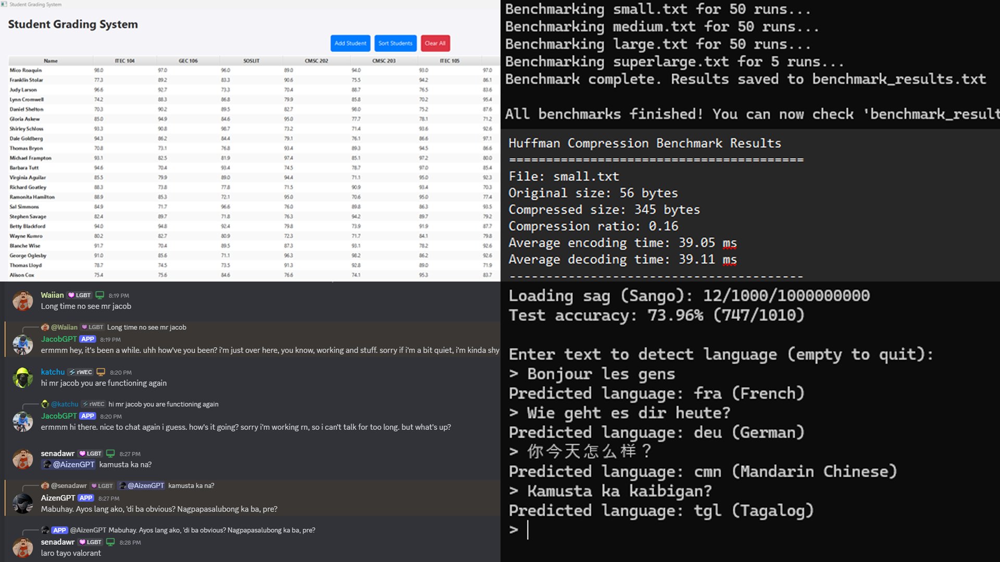

## Mico Roaquin • Portfolio

Modern, responsive portfolio site showcasing software projects and creative design work. Built with plain HTML/CSS/JS, enhanced by a couple of lightweight libraries and custom Web Components.

### ✨ Features
- **Multi‑page layout**: `index.html` (Home), `projects.html` (Software Projects), `creative.html` (Design Work)
- **Responsive UI** with utility classes and custom CSS
- **Custom Web Components**: `custom-navbar` and `dot-pattern`
- **Interactive sections**: smooth scrolling, scroll-triggered fades, and expandable project panels
- **Lightweight visuals**: animated dot canvas background, hover effects, and image modals
- **Iconography** via Feather Icons

### 📁 Project Structure
```
Portfolio/
├─ index.html              # Landing page (Hero, About, Work, Contact)
├─ projects.html           # Interactive software projects grid with expand/pin
├─ creative.html           # Creative designs (posters, motion, 3D) with modals
├─ style.css               # Global styles, animations, layout, components
├─ script.js               # Smooth scroll, section observer, panel pin/unpin
├─ components/
│  ├─ navbar.js           # <custom-navbar> responsive menu Web Component
│  └─ dot-pattern.js      # <dot-pattern> animated canvas background
├─ libs/                   # Local vendor assets (no external CDNs needed)
│  ├─ tailwindcss.js      # Utility classes (standalone runtime)
│  ├─ feather-icons.js    # Icon set used across pages
│  ├─ three.r134.min.js   # Three.js (dependency of Vanta)
│  └─ vanta-dots.js       # Vanta Dots effect (optional)
└─ images/
   ├─ sprites/            # Skill icons & UI sprites
   └─ projects/           # Project thumbnails and poster assets
```

### 🧰 Tech Stack
- **HTML5**, **CSS3**, **JavaScript (ES6)**
- **Feather Icons** for icons
- **Tailwind utility runtime** (local `libs/tailwindcss.js`)
- Optional visuals: **Vanta Dots** (`libs/vanta-dots.js`) and **Three.js**

### 🚀 Getting Started
- Option 1: Open `index.html` directly in your browser.
- Option 2 (recommended for development): Use a local web server.

Example with VS Code Live Server:
1. Install the “Live Server” extension
2. Right‑click `index.html` → “Open with Live Server”

Or with a quick Python server:
```bash
python -m http.server 8000
# then visit http://localhost:8000
```

### 🧭 Usage Notes
- The navbar links in `components/navbar.js` point to `index.html` hash sections (`#home`, `#about`, `#work`, `#contact`). They also render a mobile menu on small screens.
- The projects and creative pages use expandable “pinned” panels; click a card to expand, then use the Back button or press Escape to collapse.
- Image modal: click thumbnails inside expanded panels to open the modal; click outside or press Escape to close.

### 🖌️ Customization
- Colors, spacing, and animations live in `style.css`. Search for selectors like `.work-card`, `.skills-circle`, `.scroll-section`, and keyframes to tweak behavior.
- Add/edit cards in `projects.html` and `creative.html` by duplicating a `.project-card` block and updating the content and image paths.
- Update social links in `index.html` → Contact section.
- Replace skill icons via `images/sprites/` and adjust labels in the About section of `index.html`.

### 📸 Screenshots (optional)
You can embed previews in this README by referencing existing assets, e.g.:
```markdown


```

### 📦 Deployment
- Static hosting ready: drag‑and‑drop to Netlify, Vercel (static), or deploy to GitHub Pages.
- For GitHub Pages: push to `main`, then enable Pages for the repository; set the root as the site folder.

### 🙏 Credits
- Icons: Feather Icons (`libs/feather-icons.js`)
- Utilities: Tailwind runtime (`libs/tailwindcss.js`)
- Visuals: Vanta Dots (`libs/vanta-dots.js`) and Three.js (`libs/three.r134.min.js`)

### 📄 License
This project is provided as‑is. If you plan to open‑source it, add a license (e.g., MIT) here.


